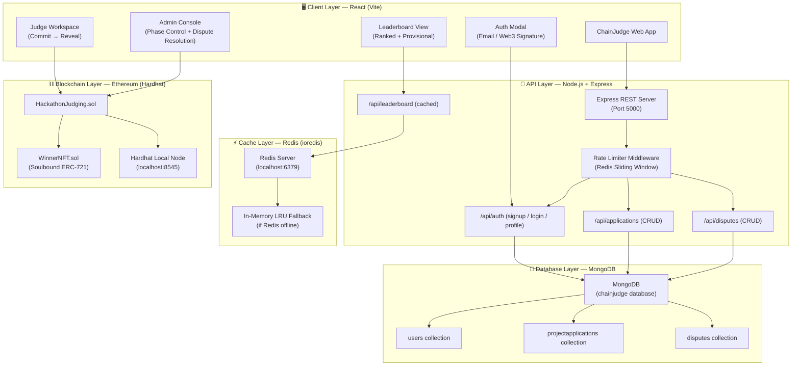
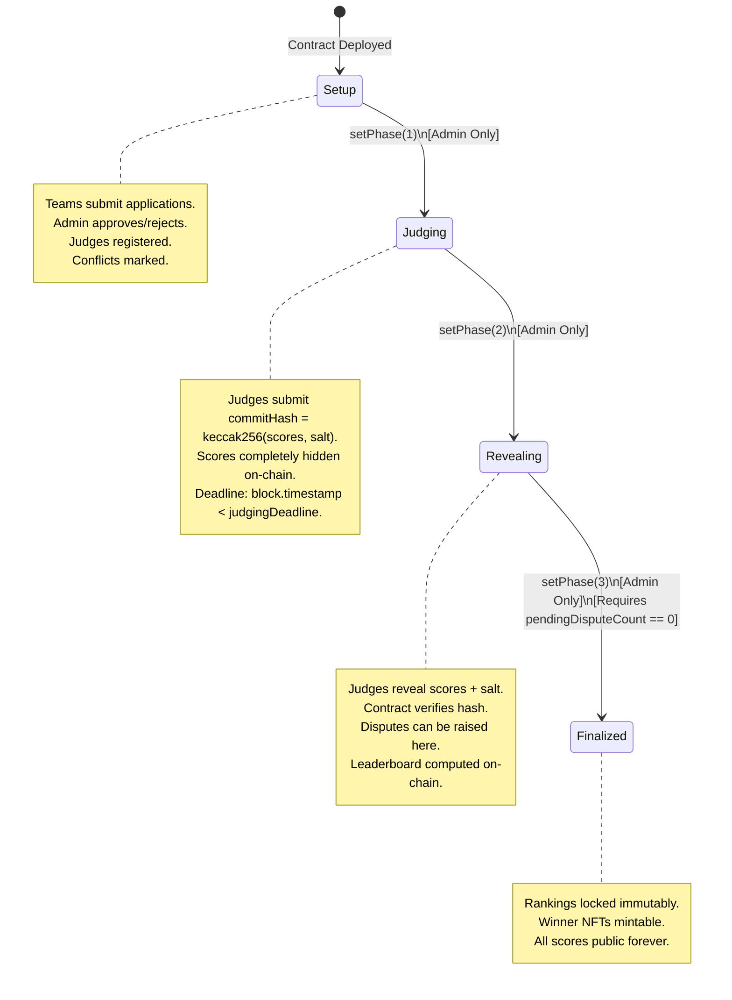

# ChainJudge — System Architecture

> **A multi-layer, production-grade system combining Ethereum smart contracts, React frontend, Node.js REST API, MongoDB persistence, and Redis caching into a single cohesive platform.**

---

## Table of Contents

1. [High-Level Architecture Diagram](#high-level-architecture-diagram)
2. [Layer-by-Layer Breakdown](#layer-by-layer-breakdown)
3. [Phase State Machine](#phase-state-machine)
4. [Data Flow Pipelines](#data-flow-pipelines)
5. [Security Model](#security-model)
6. [Component Interaction Map](#component-interaction-map)
7. [Deployment Topology](#deployment-topology)

---

## High-Level Architecture Diagram



---

## Layer-by-Layer Breakdown

### Layer 1 — Blockchain (Ethereum / Hardhat)

| Component | File | Responsibility |
|-----------|------|----------------|
| `HackathonJudging.sol` | `contracts/` | Core judging logic, phase state machine, scoring, leaderboard |
| `WinnerNFT.sol` | `contracts/` | Soulbound ERC-721 achievement certificates |
| Hardhat Node | Runtime | Local EVM chain at `http://127.0.0.1:8545` (chainId 31337) |
| `deploy.js` | `scripts/` | Automated contract deployment |
| `seed.js` | `scripts/` | Seeding projects and judges for demo |

The blockchain layer is the **single source of truth**. No score, no result, no finalisation can exist without an on-chain transaction. Every state change emits an event permanently recorded on the chain.

---

### Layer 2 — Frontend (React + Vite)

| Component | Responsibility |
|-----------|----------------|
| `App.jsx` | Root router, global modals, toast notifications |
| `useWeb3.jsx` | React context — ethers.js, auth state, profile, MongoDB sync |
| `DashboardView.jsx` | Hackathon command center — metrics, phase stepper, event feed |
| `ProjectsView.jsx` | Project directory, application modal, dispute filing |
| `JudgingView.jsx` | Blind scoring workspace — commit hash, salt manager, reveal panel |
| `LeaderboardView.jsx` | Ranked + Provisional buckets, rank medals, NFT minting |
| `AdminView.jsx` | Organiser console — phase control, dispute resolution, app queue |
| `AuthModal.jsx` | Sign-up / Login modal (Email + Web3 Wallet) |
| `ProfileModal.jsx` | User profile settings drawer |
| `api/client.js` | REST API client connecting UI to MongoDB + Redis backend |

The frontend is **blockchain-first** — it reads directly from the Ethereum contract using `ethers.js`. The MongoDB backend augments the frontend with off-chain user accounts, application tracking, and cached data.

---

### Layer 3 — API Server (Node.js + Express)

| Route | Method | Function |
|-------|--------|----------|
| `/api/health` | GET | MongoDB + Redis status |
| `/api/auth/signup` | POST | Register user → MongoDB |
| `/api/auth/login` | POST | Authenticate user → JWT token |
| `/api/auth/profile` | PUT | Update user profile |
| `/api/applications` | GET/POST | List / Submit project applications |
| `/api/applications/:id/status` | PUT | Approve / Reject application |
| `/api/disputes` | GET/POST | List / File dispute appeals |
| `/api/disputes/:id/status` | PUT | Resolve / Reject dispute |
| `/api/leaderboard` | GET | **Redis-cached leaderboard** (30s TTL) |
| `/api/leaderboard/invalidate` | POST | Flush leaderboard cache |

**Rate Limiting**: All mutation endpoints are protected by a Redis sliding-window rate limiter (15 requests/60s for auth, 10 requests/60s for applications and disputes).

---

### Layer 4 — Database (MongoDB + Mongoose)

Three Mongoose collections handle all off-chain persistent state:

```
chainjudge (database)
├── users              → User accounts, password hashes, wallet links, roles
├── projectapplications → Team registration applications with status tracking
└── disputes           → Scoring appeal records with resolution status
```

---

### Layer 5 — Cache (Redis + ioredis)

Five caching strategies are active:

| Cache Key Pattern | Strategy | TTL | Purpose |
|-------------------|----------|-----|---------|
| `leaderboard:current` | Read-through | 30s | Compiled leaderboard JSON |
| `ratelimit:<path>:<ip>` | Counter | 60s | Sliding window rate limiting |
| `session:<token>` | Key-value | 7d | Auth session fast-lookup |
| `events:latest` | Sorted Set | 120s | On-chain event log stream |
| `ipfs:<cid>` | Key-value | 3600s | IPFS project deck metadata |

**Fallback Strategy**: If the local Redis daemon is not running, `cacheService.js` falls back to an in-memory `Map` with identical TTL semantics. The server never crashes due to a missing Redis connection.

---

## Phase State Machine

The hackathon lifecycle is governed by an on-chain `enum Phase` state machine. Admin cannot skip phases or reverse direction.



> ⚠️ **Critical Safety Rule**: `setPhase(Finalized)` is blocked by a `require(pendingDisputeCount == 0)` guard. Even the admin cannot finalise the hackathon while unresolved disputes exist. This is enforced **at the EVM level**, not by UI policy.

---

## Data Flow Pipelines

### Pipeline 1 — Judge Score Submission

```
Judge UI
  → commitScore(projectId, keccak256(scores + salt))  [Phase: Judging]
  → Tx mined → ScoreCommitted event emitted
  → [Phase changes to Revealing]
  → revealScore(projectId, scores[], salt)
  → Contract verifies: keccak256(scores + salt) == storedHash
  → Scores recorded on-chain
  → Redis leaderboard cache invalidated (POST /api/leaderboard/invalidate)
  → Next leaderboard request = Cache MISS → fresh EVM query → cached for 30s
```

### Pipeline 2 — User Sign-Up

```
Auth Modal
  → signUpWithEmail(name, email, password, role)
  → apiClient.signUp() → POST /api/auth/signup
  → bcryptjs hashes password → User saved to MongoDB
  → JWT token returned → stored in localStorage
  → connectLocalAccount(roleIndex) → ethers.js Wallet connected
  → Session persisted to localStorage as chainjudge_auth_session
```

### Pipeline 3 — Team Application

```
Projects View
  → submitProjectApplication(name, description, ipfsCID)
  → Tx mined on-chain → ApplicationSubmitted event
  → apiClient.submitApplication() → POST /api/applications → MongoDB
  → Admin View shows pending application queue
  → Admin: approveProjectApplication(appId) → On-chain project registered
  → apiClient updates MongoDB status to "Approved"
```

---

## Security Model

| Threat | Mitigation |
|--------|-----------|
| Score peeking before reveal | Commit-reveal hash — scores invisible until Phase 2 |
| Admin tampering with scores | All scoring math is on-chain; admin has no score setter |
| Mentor scoring own team | `judgeConflicts[judge][project]` reverts the tx at EVM level |
| Finalising with open disputes | `require(pendingDisputeCount == 0)` hard on-chain guard |
| Replay attacks | `hasCommitted[judge][project]` mapping prevents double-commit |
| API spam / DDoS | Redis sliding-window rate limiter (ioredis) |
| Credential stuffing | bcryptjs (10 rounds) password hashing |
| JWT forgery | HS256 signed with server secret, 7d expiry |
| Soulbound NFT transfer | `_update()` override reverts on any transfer attempt |

---

## Component Interaction Map

```
useWeb3.jsx (React Context)
    │
    ├── ethers.js BrowserProvider / JsonRpcProvider
    │       └── HackathonJudging.sol (Ethereum)
    │               └── WinnerNFT.sol
    │
    └── api/client.js (REST Client)
            └── Express Server (Port 5000)
                    ├── cacheService.js (ioredis)
                    │       └── Redis Server (Port 6379)
                    │               └── In-Memory Fallback (Map)
                    └── Mongoose ODM
                            └── MongoDB (Port 27017)
                                    ├── users
                                    ├── projectapplications
                                    └── disputes
```

---

## Deployment Topology

### Local Development Setup

```
Terminal 1: npx hardhat node          → EVM node at localhost:8545
Terminal 2: npm run deploy:local      → Deploy contracts
            npm run seed:local        → Seed demo data
Terminal 3: npm run server            → Express + MongoDB at localhost:5000
Terminal 4: npm run dev               → React Vite at localhost:5173
```

### Environment Variables (`server/.env`)

```env
PORT=5000
MONGO_URI=mongodb://127.0.0.1:27017/chainjudge
REDIS_HOST=127.0.0.1
REDIS_PORT=6379
JWT_SECRET=chainjudge_super_secret_jwt_key_2026
```
