# ChainJudge — Workflow Diagrams

> **High-level and low-level workflow diagrams covering every user journey, data pipeline, and system interaction in the ChainJudge platform.**

---

## Table of Contents

1. [High-Level System Workflow](#1-high-level-system-workflow)
2. [High-Level User Journey Map](#2-high-level-user-journey-map)
3. [High-Level Hackathon Lifecycle](#3-high-level-hackathon-lifecycle)
4. [Low-Level: Team Registration Pipeline](#4-low-level-team-registration-pipeline)
5. [Low-Level: Commit–Reveal Blind Scoring](#5-low-level-commitreveal-blind-scoring)
6. [Low-Level: Leaderboard Computation & Caching](#6-low-level-leaderboard-computation--caching)
7. [Low-Level: User Authentication Flow](#7-low-level-user-authentication-flow)
8. [Low-Level: Dispute & Appeal Resolution](#8-low-level-dispute--appeal-resolution)
9. [Low-Level: Phase State Machine Transitions](#9-low-level-phase-state-machine-transitions)
10. [Low-Level: Winner NFT Minting](#10-low-level-winner-nft-minting)
11. [Low-Level: Redis Cache Decision Tree](#11-low-level-redis-cache-decision-tree)

---

## 1. High-Level System Workflow

The 10,000-foot view — how the three user roles interact with the three system layers.

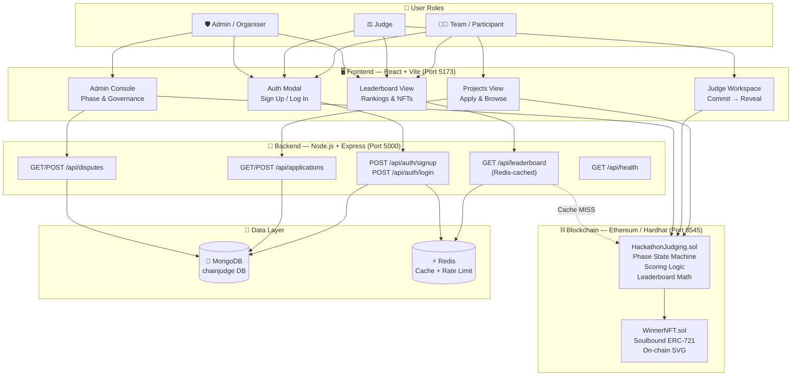

---

## 2. High-Level User Journey Map

Each role's end-to-end journey from first visit to final result.

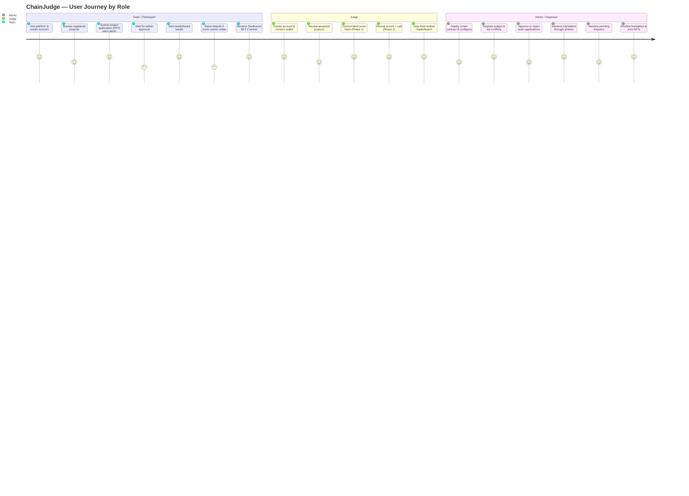

---

## 3. High-Level Hackathon Lifecycle

The four phases every hackathon goes through, with the key actions in each.

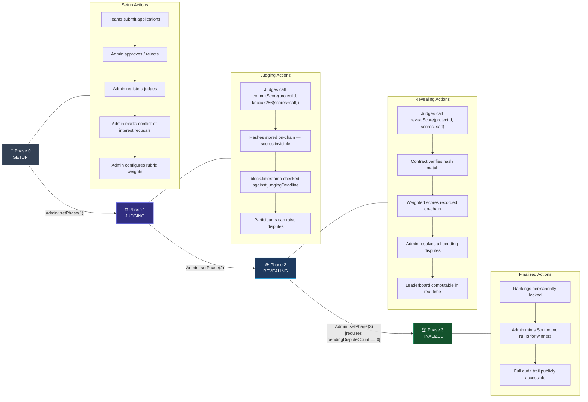

---

## 4. Low-Level: Team Registration Pipeline

The detailed flow from a team submitting an application to their project appearing in the competition.

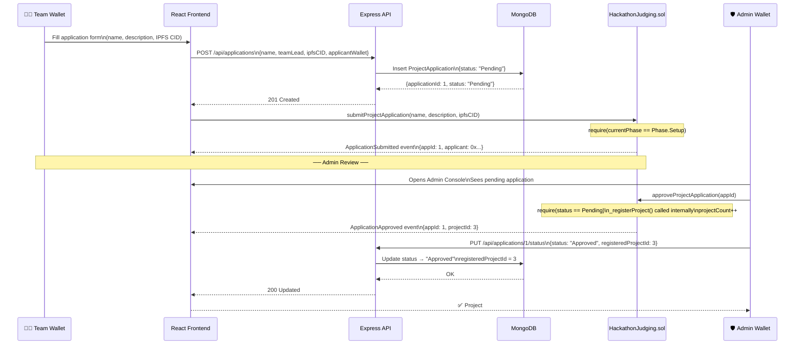

---

## 5. Low-Level: Commit–Reveal Blind Scoring

The two-phase cryptographic scoring process — the core privacy mechanism.

```mermaid
sequenceDiagram
    participant J1 as ⚖️ Judge 1
    participant J2 as ⚖️ Judge 2
    participant UI as React Frontend
    participant EVM as HackathonJudging.sol
    participant REDIS as Redis Cache

    rect rgb(30, 41, 59)
    Note over J1,REDIS: ━━━━━ PHASE 1 — JUDGING (Commit) ━━━━━

    J1->>UI: Open Judge Workspace\nSet scores [8,7,9,8] and generate random salt

    Note over UI: Client-side hash computation:\nhash = keccak256(abi.encode(8,7,9,8, salt))

    UI->>EVM: commitScore(projectId=1, hash=0x3f4a...)
    Note over EVM: ✅ require(Phase == Judging)\n✅ require(isAuthorizedJudge)\n✅ require(!judgeConflicts[judge][project])\n✅ require(!hasCommitted[judge][project])\n✅ require(block.timestamp < judgingDeadline)\nStores: commitHash[J1][1] = 0x3f4a...\nhasCommitted[J1][1] = true
    EVM-->>UI: ScoreCommitted event emitted

    J2->>UI: Open Judge Workspace\nSet scores [9,9,8,9] and generate random salt
    UI->>EVM: commitScore(projectId=1, hash=0x7b2c...)
    EVM-->>UI: ScoreCommitted event emitted

    Note over EVM: ⚠️ Scores 100% invisible on-chain\nOnly hashes are stored
    end

    Note over J1,REDIS: ── Admin advances to Phase 2 ──

    rect rgb(14, 30, 58)
    Note over J1,REDIS: ━━━━━ PHASE 2 — REVEALING ━━━━━

    J1->>UI: Click "Reveal Scores"\nRetrieve saved [8,7,9,8] + salt

    UI->>EVM: revealScore(projectId=1, 8, 7, 9, 8, salt)
    Note over EVM: Compute: keccak256(abi.encode(8,7,9,8,salt))\nCompare with stored commitHash[J1][1]\n✅ Hash matches!\nweightedScore = (8×25 + 7×25 + 9×25 + 8×25) / 10 = 80\nprojectScores[1].push(80)\nhasRevealed[J1][1] = true
    EVM-->>UI: ScoreRevealed(J1, projectId=1, score=80)

    J2->>UI: Click "Reveal Scores"
    UI->>EVM: revealScore(projectId=1, 9, 9, 8, 9, salt)
    Note over EVM: weightedScore = (9×25 + 9×25 + 8×25 + 9×25)/10 = 87.5 → 87
    EVM-->>UI: ScoreRevealed(J2, projectId=1, score=87)

    UI->>REDIS: POST /api/leaderboard/invalidate
    REDIS-->>UI: Cache cleared ✅
    Note over REDIS: Next leaderboard request\nwill recompute from chain
    end
```

---

## 6. Low-Level: Leaderboard Computation & Caching

How the leaderboard goes from raw on-chain scores to a cached API response in under 2ms.

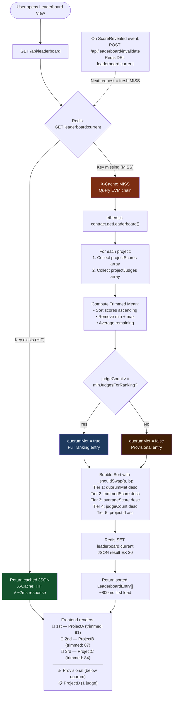

---

## 7. Low-Level: User Authentication Flow

Both Email/Password and Web3 Wallet authentication paths.

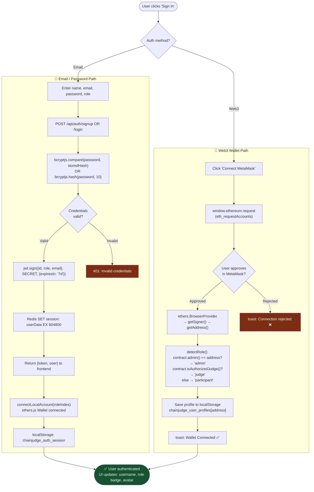

---

## 8. Low-Level: Dispute & Appeal Resolution

End-to-end flow from a participant raising a dispute to admin resolution.

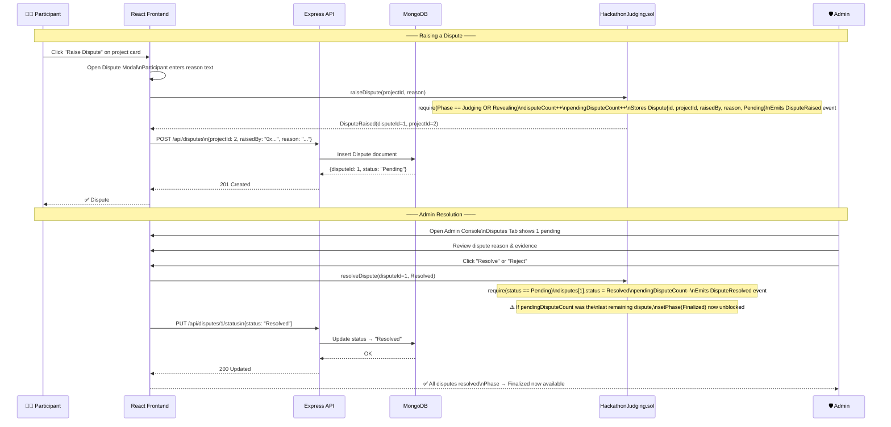

---

## 9. Low-Level: Phase State Machine Transitions

Detailed guards and side-effects of each phase transition.

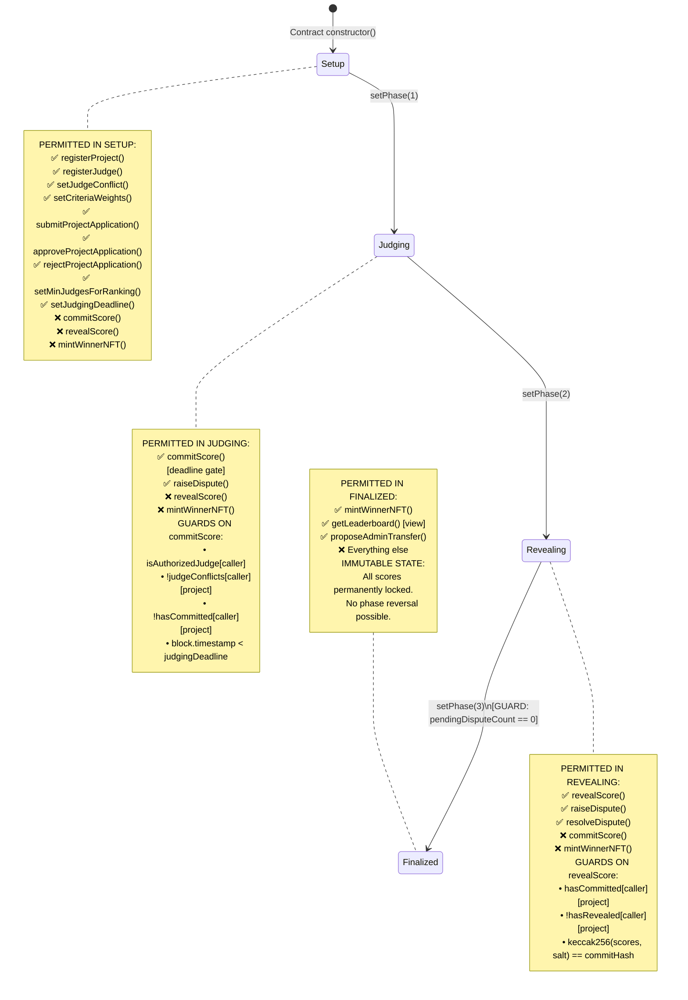

---

## 10. Low-Level: Winner NFT Minting

How the Soulbound certificate is generated and bound to a wallet.

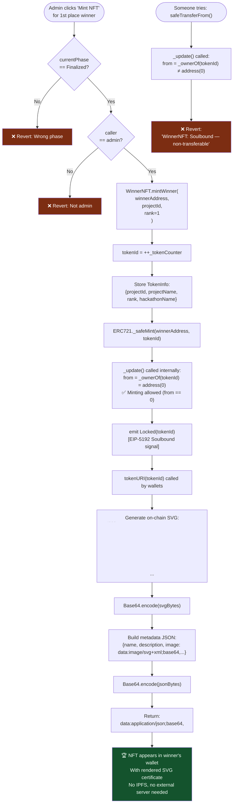

---

## 11. Low-Level: Redis Cache Decision Tree

The complete decision logic for every cache operation in `cacheService.js`.

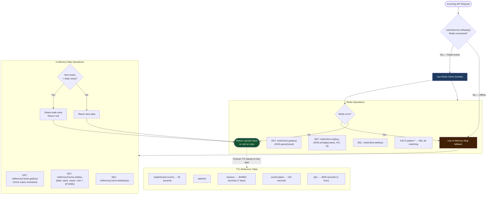

---

## Summary

| Diagram | Type | Covers |
|---------|------|--------|
| [1. System Workflow](#1-high-level-system-workflow) | High-Level | All 3 layers, 3 user roles, data flow |
| [2. User Journey Map](#2-high-level-user-journey-map) | High-Level | Step-by-step experience per role |
| [3. Hackathon Lifecycle](#3-high-level-hackathon-lifecycle) | High-Level | 4 phases, permitted actions per phase |
| [4. Team Registration](#4-low-level-team-registration-pipeline) | Low-Level | Sequence: UI → API → MongoDB → EVM |
| [5. Commit–Reveal Scoring](#5-low-level-commitreveal-blind-scoring) | Low-Level | Cryptographic two-phase scoring |
| [6. Leaderboard Caching](#6-low-level-leaderboard-computation--caching) | Low-Level | Redis HIT/MISS, trimmed mean sort |
| [7. Authentication](#7-low-level-user-authentication-flow) | Low-Level | Email + Web3 dual auth paths |
| [8. Dispute Resolution](#8-low-level-dispute--appeal-resolution) | Low-Level | Full dispute lifecycle sequence |
| [9. Phase State Machine](#9-low-level-phase-state-machine-transitions) | Low-Level | Guards, reverts, permitted ops |
| [10. NFT Minting](#10-low-level-winner-nft-minting) | Low-Level | Soulbound mint + on-chain SVG |
| [11. Redis Decision Tree](#11-low-level-redis-cache-decision-tree) | Low-Level | Cache get/set/del + fallback logic |
